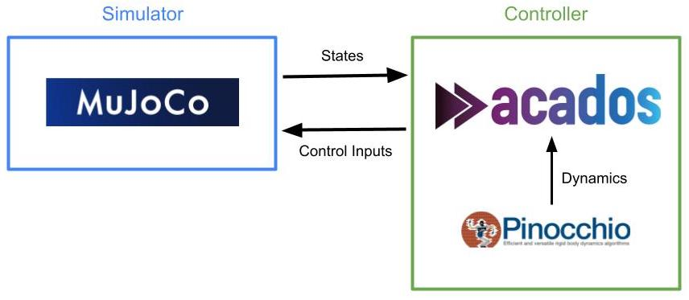

# Simulator - Controller for Model Predicitve Control
## Overview

This repository provides a modular framework for simulating and controlling robotic systems (e.g., cartpole, pendulum) using Model Predictive Control (MPC) with MuJoCo and Pinocchio. The codebase supports uses MuJoCo for the simulator with acados and pinocchio for optimal control.

---

## Structure

- **main.py**: Entry point for running MuJoCo simulations with MPC.
- **controller.py**: Implements the [`AcadosMPCController`](controller.py) class and MPC setup using ACADOS.
- **simulator.py**: Contains MuJoCo simulation loop ([`run_simulation`](simulator.py)), model loading, and configuration utilities.
- **pin_models/**: Pinocchio-based models and dynamics classes
- **pin_exporter.py**: Converts Pinocchio models to ACADOS ODE models ([`export_ode_model`](pin_exporter.py)).
- **Utils.py**: Helpers for plotting ([`plot_signals`](Utils.py)), saving videos ([`save_video`](Utils.py)), and run summaries ([`save_summary`](Utils.py)).
- **pin_visualizer.py**: Visualizes Pinocchio models using Meshcat.
- **config.yaml**: Central configuration for models, MPC, and simulation parameters.

---

## Getting Started

The codebase uses pixi to manage and run all the tasks.

1. Clone the repo
2. 
```
cd mpc_mujoco
pixi install
```
3. 
Build and install acados from source
```
pixi run acados_full
```
4. Test acados installation
```
pixi run minimal_example
```
5. Run cartpole model
```
pixi run main_cartpole
```
Results are saved in the outputs folder. A video, config and also graph. If render is set to false, the video will not be recorded.

## Customisation

To create new models, a .xml will need to be created for the model in [models_xml](models_xml). It can then be visualised with:
```
pixi shell
python -m mujoco.viewer
```

A similar model will also need to be created for pinocchio in [pin_models](pin_models). It can also be visualized with meshcat:
```
python pin_visualizer.py pendulum
```
The new model will need to be added to the if statement at the top of the [pin_visualizer.py](pin_visualizer.py) and [pin_exporter.py](pin_exporter.py)

## Notes
Add the configs to the [config.yaml]](config.yaml) by creating a new section for your model. Some settings like the lengths or pole/beams can't be added in and will need to be defined in the [models_xml](models_xml) and [pin_models](pin_models) instead.

## Data Structure
To perform offline training of the neural networks, data will be collected. In the simpliest case, it will be the states (pos & vel) with the associated cost as queried from acados. Respectively, this will form the input and output of the model which acts as the long horizon oracle. 

### Cartpole
`states = (x, theta, x_dot, theta_dot)`
`cost = cost`

