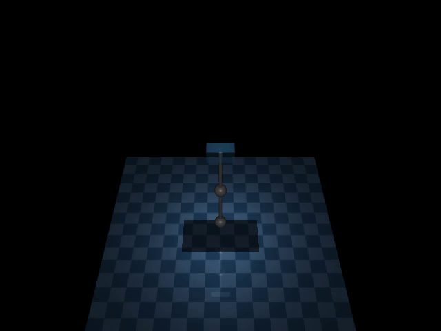
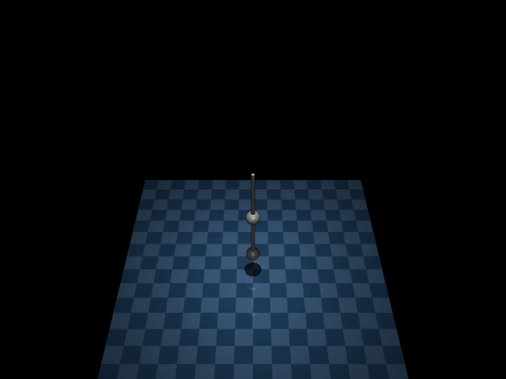
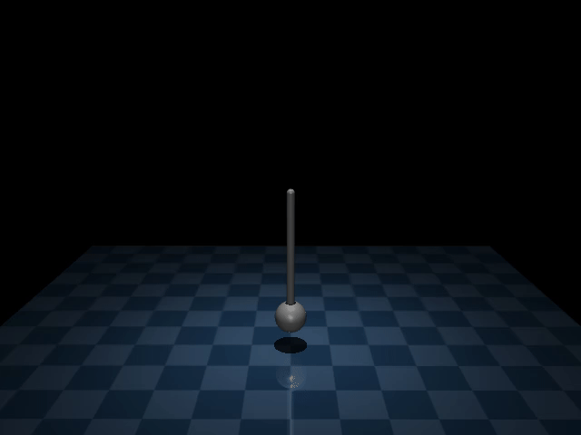
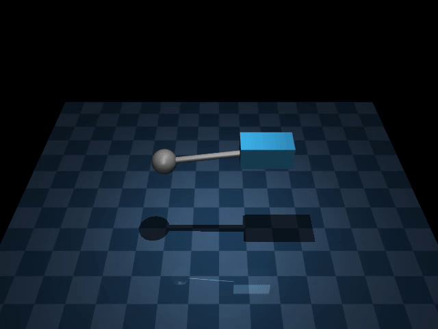
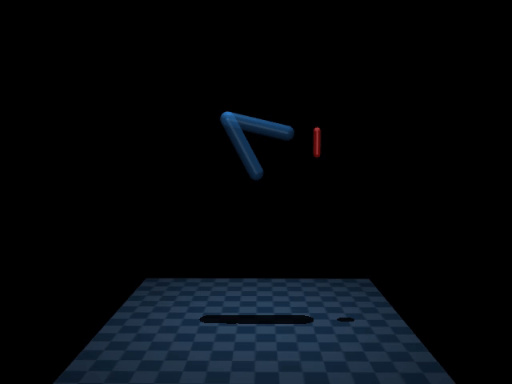
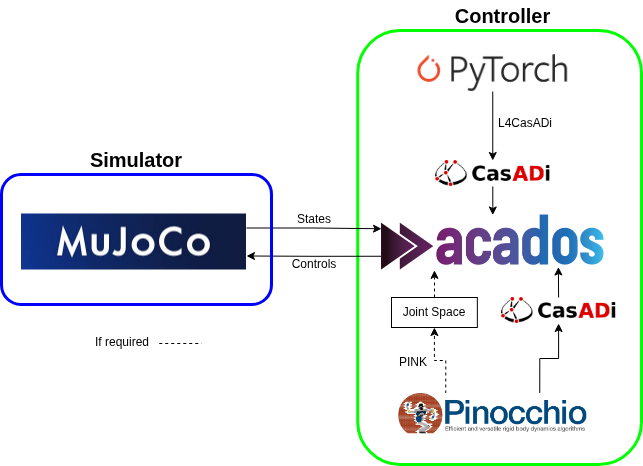
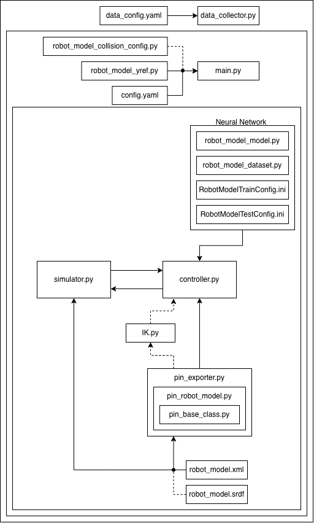

# Simulator - Controller for Model Predicitve Control

## Overview
This repository provides a modular framework for simulating and controlling robotic systems (e.g., cartpole, pendulum, manipulators) using Model Predictive Control (MPC) with MuJoCo as the simulator and acados as the controller. Below are some example simulations.

<!-- 
 -->

<p align="center">
  
  
  
  
  
</p>

Block diagram overview of the framework. Two distinct blocks for the simulator and controller where each is independent of the other, allowing the simulator to be replaced by an actual robot. The simulator uses MuJoCo while the controller uses acados. Additionally, Pinocchio provides efficient rigid body dynamics algorithms which is then converted to CasADi symbolic expressions to integrate with acados. PyTorch is used as the deep learning framework which is also converted into CasADi symbolic expressions through the use of L4CasADi. Finally, if inverse kinematics is required, PINK is utilized. Dotted lines signify optional connections.

<p align="center">
  
</p>

## System Architecture

System architecture diagram showing module interactions, configuration inputs, and data flow between the simulator, controller, neural-network components, and robot model utilities. Dotted lines signify optional connections.

<p align="center">
  
</p>

## Installation & Usage

The codebase uses pixi to manage the environmant and run all the tasks. I assume that pixi has already been installed. If not visit [pixi installation](https://pixi.sh/dev/installation/).

1. **Clone the repository**
    ```
    git clone git@github.com:Nicosoh/mpc_MuJoCo.git
    ```

2. **Enter the project directory and install dependencies**
    ```
    cd mpc_mujoco
    pixi install
    ```

3. **Build and install ACADOS from source**
    ```
    pixi run acados_full
    ```

4. **Verify ACADOS installation**
    ```
    pixi run minimal_example
    ```

5. **Run the Cartpole model**
    ```
    pixi run main_cartpole
    ```
    or
    ```
    pixi shell
    python main.py cartpole
    ```
Results are saved in the data folder. A video, config and also graph. If render is set to false, the video will not be recorded.

## Data Collection

To collect data for a robot model:
```
pixi run data_collector [robot_model]
```
And to visualize the data:
```
pixi run data_viz [robot_model] [folder_name]
```
For example with the pendulum:
```
pixi run data_collector pendulum
pixi run data_viz pendulum 2025-12-02_17-59-3e5_pendulum_data_collection
```
Plots will be saved in the [folder_name]/plots

## Training a Neural Network
To train a model, the dataset and DL model needs to be defined in the [`train config`](neural_network/configs/PendulumModelTrainConfig.ini).
```
pixi run train_model [train_config]
```
To evaluate the model, the test dataset and model weights needs to be defiend in the [`test config`](neural_network/configs/PendulumModelTestConfig.ini).
```
pixi run evaluate_model [test_config]
```
## Configurations

Each module has its own configuration file:

- **main.py** → [`config.yaml`](config.yaml)
- **Goal States(yrefs)** → [`yrefs`](yrefs)
- **Collisions/Obstacles** → [`two_dof_arm_collision_config.py`](collision_config/two_dof_arm_collision_config.py)
  - Obstacles are only used for the manipulators.
- **Data Collector** → [`data_config.yaml`](data_collction/data_config.yaml)
- **Neural Network Training** → [`PendulumModelTrainConfig.ini`](neural_network/configs/PendulumModelTrainConfig.ini)
- **Neural Network Evaluation** → [`PendulumModelTestConfig.ini`](neural_network/configs/PendulumModelTestConfig.ini)


## References

- **MuJoCo** — A fast, physics-based simulation engine for robotics and control  
  https://mujoco.org/

- **acados** — A high-performance optimization framework for embedded optimal control  
  https://github.com/acados/acados

- **Pinocchio** — A fast and efficient library for rigid body dynamics and kinematics  
  https://github.com/stack-of-tasks/pinocchio

- **PINK** — Inverse kinematics solver built on top of Pinocchio  
  https://github.com/stephane-caron/pink

- **CasADi** — Symbolic framework and numerical optimization library for nonlinear control  
  https://web.casadi.org/

- **PyTorch** — Deep learning framework for tensor computation and neural networks  
  https://pytorch.org/

- **l4casadi** — Lightweight tools for integrating neural networks with CasADi  
  https://github.com/Tim-Salzmann/l4casadi